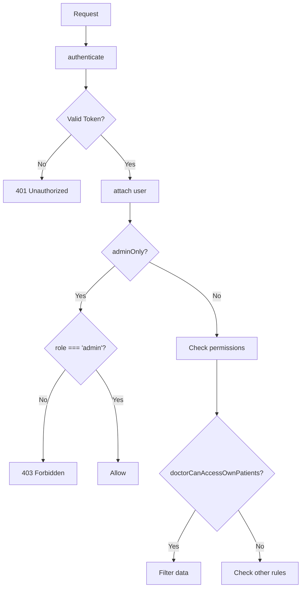

# Dental Clinic Authorization & Security Improvement Plan

## Executive Summary

This document outlines a comprehensive plan to improve authorization and security for the dental clinic application. The current implementation has **critical security vulnerabilities** that allow any authenticated user to access sensitive customer data.

---

## Current Security Analysis

### ✅ What's Working Well

1. **Authentication middleware** (`authenticate`) properly validates JWT tokens
2. **Password hashing** using bcrypt with salt
3. **User roles defined** in model: `admin`, `doctor`, `receptionist`
4. **Authorization middleware** (`authorize`) exists but is **NOT being used**
5. **Notification service** properly filters by userId

### 🚨 Critical Security Vulnerabilities

#### 1. **Missing Role-Based Authorization on Routes**
All routes only use `authenticate` but never apply `authorize` middleware:
```typescript
// CURRENT (INSECURE) - backend/src/routes/patients.ts
router.use(authenticate);  // ✓ Authenticates user
// BUT NO authorize() call! - Anyone can access any data
```

#### 2. **No Admin-Only Data Access**
Any logged-in user can:
- View all patient records (including medical notes, allergies)
- Delete patient records
- Access revenue/financial data
- View all appointments
- Export any data

#### 3. **Unrestricted User Registration**
```typescript
// Anyone can register themselves as admin!
POST /api/auth/register
{ "email": "hacker@clinic.com", "password": "123456", "role": "admin" }
```

#### 4. **Hardcoded JWT Secret**
```typescript
// backend/src/middleware/auth.ts line 26, 67
const secret = process.env.JWT_SECRET || 'your-secret-key';  // DANGEROUS!
```

#### 5. **No Audit Logging**
No record of:
- Who accessed patient data
- Who deleted records
- Who viewed sensitive information

#### 6. **Sensitive Data Exposure**
Patient responses include:
- Full medical notes
- Allergies
- Emergency contacts
- QR codes (which can be used for impersonation)

---

## Implementation Plan

### Phase 1: Enhanced Authorization Middleware



### Phase 2: Route-Level Authorization

#### Patients Routes
| Method | Endpoint | Required Role | Rationale |
|--------|----------|---------------|-----------|
| GET | `/patients` | `admin`, `doctor`, `receptionist` | All staff need patient access |
| GET | `/patients/:id` | `admin`, `doctor`, `receptionist` | View specific patient |
| POST | `/patients` | `admin`, `receptionist` | Create new patient |
| PUT | `/patients/:id` | `admin`, `doctor`, `receptionist` | Update patient info |
| DELETE | `/patients/:id` | `admin` **ONLY** | Delete patient record |
| GET | `/patients/:id/qr` | `admin`, `receptionist` | Generate QR for check-in |

#### Appointments Routes
| Method | Endpoint | Required Role | Rationale |
|--------|----------|---------------|-----------|
| GET | `/appointments` | `admin`, `doctor`, `receptionist` | View appointments |
| GET | `/appointments/today` | `admin`, `doctor`, `receptionist` | Today's schedule |
| POST | `/appointments` | `admin`, `receptionist` | Schedule appointment |
| PUT | `/appointments/:id` | `admin`, `doctor` | Update appointment |
| DELETE | `/appointments/:id` | `admin`, `receptionist` | Cancel appointment |
| POST | `/:id/checkin` | `admin`, `receptionist` | Check-in patient |

#### Dashboard Routes
| Method | Endpoint | Required Role | Rationale |
|--------|----------|---------------|-----------|
| GET | `/dashboard/stats` | `admin` **ONLY** | Revenue, sensitive stats |
| GET | `/dashboard/appointments/today` | `admin`, `doctor`, `receptionist` | Today's schedule |

#### Auth Routes
| Method | Endpoint | Required Role | Rationale |
|--------|----------|---------------|-----------|
| POST | `/auth/register` | **DISABLED** | No public registration |
| POST | `/auth/register` | `admin` **ONLY** | Admin creates staff accounts |

### Phase 3: Data Filtering by Role

#### Admin Sees Everything
- All patient fields including sensitive medical data
- Financial/revenue statistics
- All staff information
- Audit logs

#### Doctor Sees
- Their assigned patients
- Patient basic info + medical notes (for treatment)
- Their appointments

#### Receptionist Sees
- Patient basic info (name, contact, appointments)
- No medical notes or allergies
- Can create/modify appointments

### Phase 4: Audit Logging

Create new Audit model:
```typescript
interface IAuditLog {
  userId: Types.ObjectId;
  action: 'CREATE' | 'READ' | 'UPDATE' | 'DELETE' | 'EXPORT';
  resource: 'patient' | 'appointment' | 'user' | 'payment';
  resourceId: Types.ObjectId;
  ipAddress: string;
  userAgent: string;
  timestamp: Date;
  details?: Record<string, unknown>;
}
```

### Phase 5: Secure Registration

1. **Disable public registration** completely
2. Add admin-only user creation endpoint
3. First admin must be created via environment variable or seed script

---

## Security Concerns to Address Immediately

### 🔴 CRITICAL - Fix Now

1. **Remove public registration** - Anyone can become admin
2. **Add authorize middleware** to all routes
3. **Secure JWT secret** - Must use environment variable in production
4. **Add rate limiting** - Prevent brute force attacks

### 🟠 HIGH - Fix Soon

1. **Add audit logging** - Track who accesses what data
2. **Filter sensitive data** - Don't expose medical notes to receptionists
3. **Add request validation** - Prevent IDOR attacks
4. **Add HTTPS** - Required for production

### 🟡 MEDIUM - Plan for Later

1. **Add two-factor authentication**
2. **Session management** - Token blacklisting
3. **API versioning**
4. **IP whitelisting** for admin operations

---

## Files to Modify

| File | Changes |
|------|---------|
| `backend/src/middleware/auth.ts` | Add enhanced authorize, audit logging |
| `backend/src/routes/patients.ts` | Add role-based authorization |
| `backend/src/routes/appointments.ts` | Add role-based authorization |
| `backend/src/routes/dashboard.ts` | Add admin-only restrictions |
| `backend/src/routes/auth.ts` | Restrict registration |
| `backend/src/services/patientService.ts` | Add data filtering |
| `backend/src/services/appointmentService.ts` | Add doctor-specific queries |
| `backend/src/models/AuditLog.ts` | NEW - Create audit log model |
| `backend/src/controllers/authController.ts` | Restrict registration |

---

## Recommended Implementation Order

1. **Immediate**: Disable public registration
2. **Day 1**: Add authorize middleware to all routes
3. **Day 2**: Add role-based data filtering in services
4. **Day 3**: Implement audit logging
5. **Day 4**: Test all authorization scenarios
6. **Day 5**: Security review and penetration testing

---

## Questions for Clarification

1. Should doctors be able to see ALL patients or only their assigned ones?
2. Do you need a separate "manager" role for someone who can view stats but not delete?
3. Should patient QR codes be restricted from certain roles?
4. Do you want to keep the current 7-day token expiry or reduce it?
