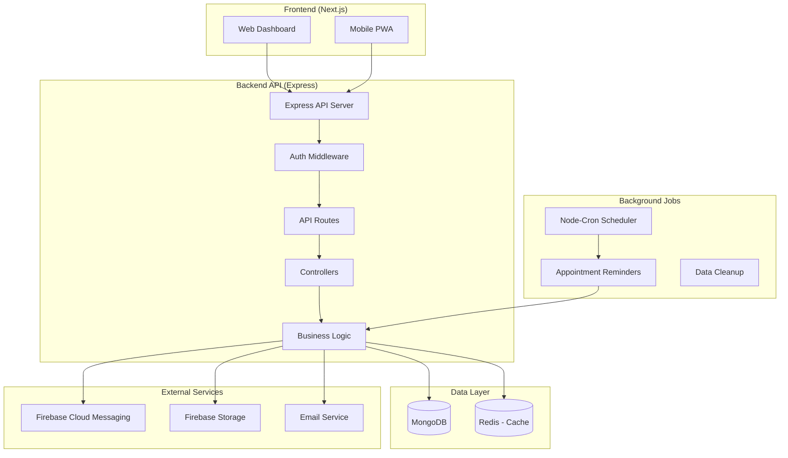
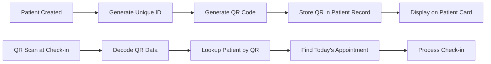
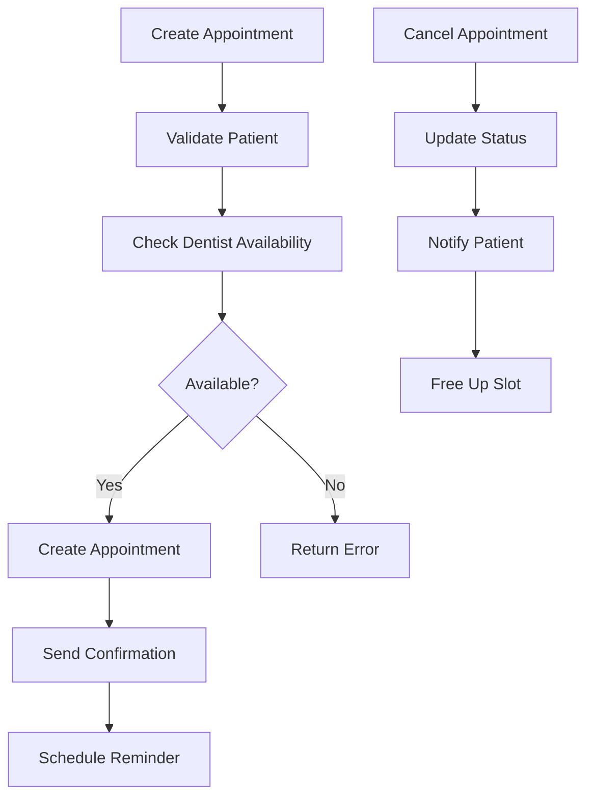
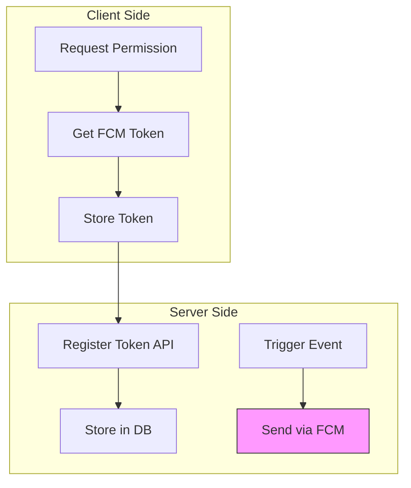
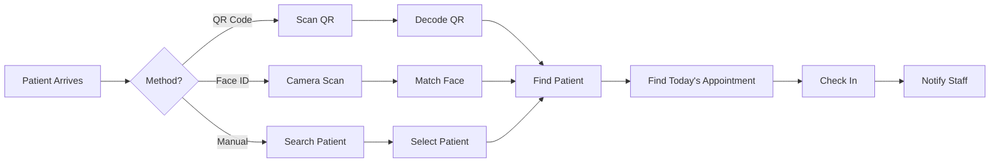
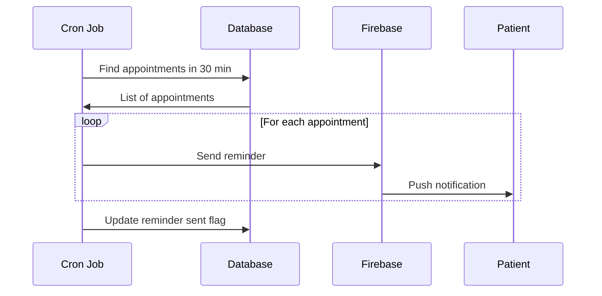

# Dental Clinic Backend Architecture

## Overview

This document outlines the complete backend architecture for the dental clinic application. The backend will be built using **Node.js with Express** and will integrate with **Firebase** for push notifications and **MongoDB** (or PostgreSQL) for data storage.

## Technology Stack

| Component | Technology | Purpose |
|-----------|------------|---------|
| Runtime | Node.js (v18+) | JavaScript runtime |
| Framework | Express.js | REST API framework |
| Database | MongoDB with Mongoose | Primary data store |
| Authentication | JWT + bcrypt | User authentication |
| Push Notifications | Firebase Cloud Messaging | Push notifications |
| File Storage | Firebase Storage / Local | Image uploads |
| QR Generation | qrcode library | Generate QR codes |
| Queue/Jobs | node-cron | Scheduled tasks |
| Validation | Joi / Zod | Request validation |
| Logging | Morgan + Winston | API logging |

## System Architecture Diagram



## Database Schema

### Collections

```mermaid
erDiagram
    Users ||--o{ Appointments : "creates"
    Patients ||--o{ Appointments : "has"
    Patients ||--o{ Treatments : "has"
    Patients ||--o{ Payments : "has"
    Dentists ||--o{ Appointments : "handles"
    Dentists ||--o{ Treatments : "performs"
    Appointments ||--o{ Notifications : "triggers"

    Users {
        string id PK
        string email unique
        string password
        string name
        string role
        boolean isActive
        timestamps
    }

    Patients {
        string id PK
        string qrCode unique
        string faceData
        string faceTemplate
        string name
        string address
        string telephone
        int age
        string occupation
        string status
        string complaint
        string gender
        date dateOfBirth
        string email
        string emergencyContact
        string emergencyPhone
        text medicalNotes
        string allergies
        boolean isFrequent
        date lastVisit
        timestamps
    }

    Appointments {
        string id PK
        string patientId FK
        string dentistId FK
        date appointmentDate
        string appointmentTime
        int duration
        string status
        string reason
        text notes
        boolean isCheckedIn
        datetime checkedInAt
        timestamps
    }

    Treatments {
        string id PK
        string patientId FK
        string dentistId FK
        date recordDate
        int recordNo
        string description
        string treatmentTime
        decimal debit
        decimal credit
        timestamps
    }

    Payments {
        string id PK
        string patientId FK
        string appointmentNo
        date date
        string time
        string description
        string type
        decimal debit
        decimal credit
        decimal balance
        string status
        date creditDate
        timestamps
    }

    Dentists {
        string id PK
        string userId FK
        string specialization
        string licenseNo
        string phone
        boolean isAvailable
        timestamps
    }

    Notifications {
        string id PK
        string userId FK
        string type
        string title
        string body
        string fcmToken
        boolean isRead
        json data
        timestamps
    }
```

## API Endpoints

### Authentication

| Method | Endpoint | Description | Auth |
|--------|----------|-------------|------|
| POST | `/api/auth/login` | User login | Public |
| POST | `/api/auth/register` | Register new user | Admin |
| POST | `/api/auth/refresh` | Refresh token | Public |
| POST | `/api/auth/logout` | User logout | User |
| GET | `/api/auth/me` | Get current user | User |

### Patients

| Method | Endpoint | Description | Auth |
|--------|----------|-------------|------|
| GET | `/api/patients` | List patients (paginated) | User |
| GET | `/api/patients/:id` | Get patient by ID | User |
| GET | `/api/patients/search?q=` | Search patients | User |
| GET | `/api/patients/recent` | Get recent patients | User |
| GET | `/api/patients/frequent` | Get frequent patients | User |
| POST | `/api/patients` | Create new patient | User |
| PUT | `/api/patients/:id` | Update patient | User |
| DELETE | `/api/patients/:id` | Delete patient | User |
| GET | `/api/patients/:id/qr` | Get patient's QR code | User |
| POST | `/api/patients/:id/send-qr-email` | Send QR via email | User |
| POST | `/api/patients/identify/face` | Identify by face | User |

### Appointments

| Method | Endpoint | Description | Auth |
|--------|----------|-------------|------|
| GET | `/api/appointments` | List appointments | User |
| GET | `/api/appointments/today` | Get today's appointments | User |
| GET | `/api/appointments/week` | Get week's appointments | User |
| GET | `/api/appointments/:id` | Get appointment by ID | User |
| POST | `/api/appointments` | Create appointment | User |
| PUT | `/api/appointments/:id` | Update appointment | User |
| DELETE | `/api/appointments/:id` | Cancel appointment | User |
| POST | `/api/appointments/:id/checkin` | Check-in patient | User |

### Treatments

| Method | Endpoint | Description | Auth |
|--------|----------|-------------|------|
| GET | `/api/treatments?patientId=` | List treatments | User |
| GET | `/api/treatments/:id` | Get treatment | User |
| POST | `/api/treatments` | Create treatment | Dentist |
| PUT | `/api/treatments/:id` | Update treatment | Dentist |

### Payments

| Method | Endpoint | Description | Auth |
|--------|----------|-------------|------|
| GET | `/api/payments?patientId=` | List payments | User |
| POST | `/api/payments` | Create payment | User |
| PUT | `/api/payments/:id` | Update payment | User |

### Dashboard

| Method | Endpoint | Description | Auth |
|--------|----------|-------------|------|
| GET | `/api/dashboard/stats` | Get dashboard statistics | User |
| GET | `/api/dashboard/appointments/today` | Today's appointments | User |

### Notifications

| Method | Endpoint | Description | Auth |
|--------|----------|-------------|------|
| POST | `/api/notifications/register-token` | Register FCM token | User |
| GET | `/api/notifications` | Get user notifications | User |
| PUT | `/api/notifications/:id/read` | Mark as read | User |
| PUT | `/api/notifications/read-all` | Mark all as read | User |

## Project Structure

```
backend/
├── src/
│   ├── config/
│   │   ├── database.ts        # MongoDB connection
│   │   ├── firebase.ts        # Firebase configuration
│   │   └── env.ts             # Environment variables
│   ├── middleware/
│   │   ├── auth.ts           # JWT authentication
│   │   ├── validate.ts        # Request validation
│   │   └── error.ts          # Error handling
│   ├── models/
│   │   ├── User.ts           # User model
│   │   ├── Patient.ts        # Patient model
│   │   ├── Appointment.ts    # Appointment model
│   │   ├── Treatment.ts      # Treatment model
│   │   ├── Payment.ts        # Payment model
│   │   └── Notification.ts   # Notification model
│   ├── routes/
│   │   ├── auth.ts           # Auth routes
│   │   ├── patients.ts       # Patient routes
│   │   ├── appointments.ts    # Appointment routes
│   │   ├── treatments.ts     # Treatment routes
│   │   ├── payments.ts       # Payment routes
│   │   ├── dashboard.ts      # Dashboard routes
│   │   └── notifications.ts  # Notification routes
│   ├── controllers/
│   │   ├── authController.ts
│   │   ├── patientController.ts
│   │   ├── appointmentController.ts
│   │   ├── treatmentController.ts
│   │   ├── paymentController.ts
│   │   ├── dashboardController.ts
│   │   └── notificationController.ts
│   ├── services/
│   │   ├── authService.ts
│   │   ├── patientService.ts
│   │   ├── appointmentService.ts
│   │   ├── qrCodeService.ts
│   │   ├── faceRecognitionService.ts
│   │   ├── notificationService.ts
│   │   ├── emailService.ts
│   │   └── reminderService.ts
│   ├── jobs/
│   │   ├── reminders.ts      # Appointment reminders
│   │   └── cleanup.ts        # Data cleanup
│   ├── utils/
│   │   ├── helpers.ts
│   │   └── constants.ts
│   ├── app.ts               # Express app setup
│   └── server.ts            # Server entry point
├── package.json
├── tsconfig.json
└── .env.example
```

## Key Features Implementation

### 1. QR Code System



**Implementation:**
- Use `qrcode` npm package to generate QR codes
- QR contains patient ID in format: `DENTAL-{patientId}`
- QR stored as base64 string in patient record
- Endpoints: `GET /api/patients/:id/qr` returns QR image

### 2. Appointment Scheduling



**Implementation:**
- Store appointment time slots in MongoDB
- Prevent double booking with unique compound index
- Support recurring appointments
- Automatic status updates based on time

### 3. Firebase Push Notifications



**Implementation:**
- Client registers FCM token on login
- Store tokens in database linked to user
- Use Firebase Admin SDK for server-side sends
- Support notification types:
  - New appointment
  - Check-in alerts
  - Appointment reminders
  - Status changes

### 4. Check-in System



**Implementation:**
- QR: Decode patient ID from QR string
- Face: Use face-api.js for face matching
- Manual: Search by name/phone
- Verify appointment exists for today
- Update appointment status to CONFIRMED

### 5. Background Jobs (Reminders)



**Implementation:**
- Use `node-cron` for scheduling
- Run every 5 minutes to check upcoming appointments
- Send reminders at configured intervals (15/30/60 min)
- Track sent reminders to prevent duplicates

## Environment Variables

```env
# Server
PORT=3001
NODE_ENV=development

# Database
MONGODB_URI=mongodb://localhost:27017/dental-clinic
MONGODB_USER=admin
MONGODB_PASSWORD=password

# JWT
JWT_SECRET=your-jwt-secret-key
JWT_EXPIRES_IN=7d

# Firebase (Server-side)
FIREBASE_ADMIN_PRIVATE_KEY=your-private-key
FIREBASE_ADMIN_CLIENT_EMAIL=firebase-adminsdk@project.iam.gserviceaccount.com
FIREBASE_PROJECT_ID=your-project-id

# Email (SMTP)
SMTP_HOST=smtp.gmail.com
SMTP_PORT=587
SMTP_USER=your-email@gmail.com
SMTP_PASS=your-app-password

# Frontend URL (for CORS)
FRONTEND_URL=http://localhost:3000
```

## Security Considerations

1. **Authentication**: JWT tokens with httpOnly cookies
2. **Authorization**: Role-based access (Admin, Doctor, Receptionist)
3. **Input Validation**: Joi schema validation on all inputs
4. **Rate Limiting**: Prevent brute force attacks
5. **CORS**: Only allow frontend domain
6. **Helmet**: Security headers
7. **Sanitization**: Prevent XSS and SQL injection

## Deployment Checklist

- [ ] Set up MongoDB Atlas or local instance
- [ ] Configure Firebase project
- [ ] Set up environment variables
- [ ] Configure SSL/TLS
- [ ] Set up PM2 for process management
- [ ] Configure Nginx reverse proxy
- [ ] Set up monitoring and logging
- [ ] Configure backup strategy