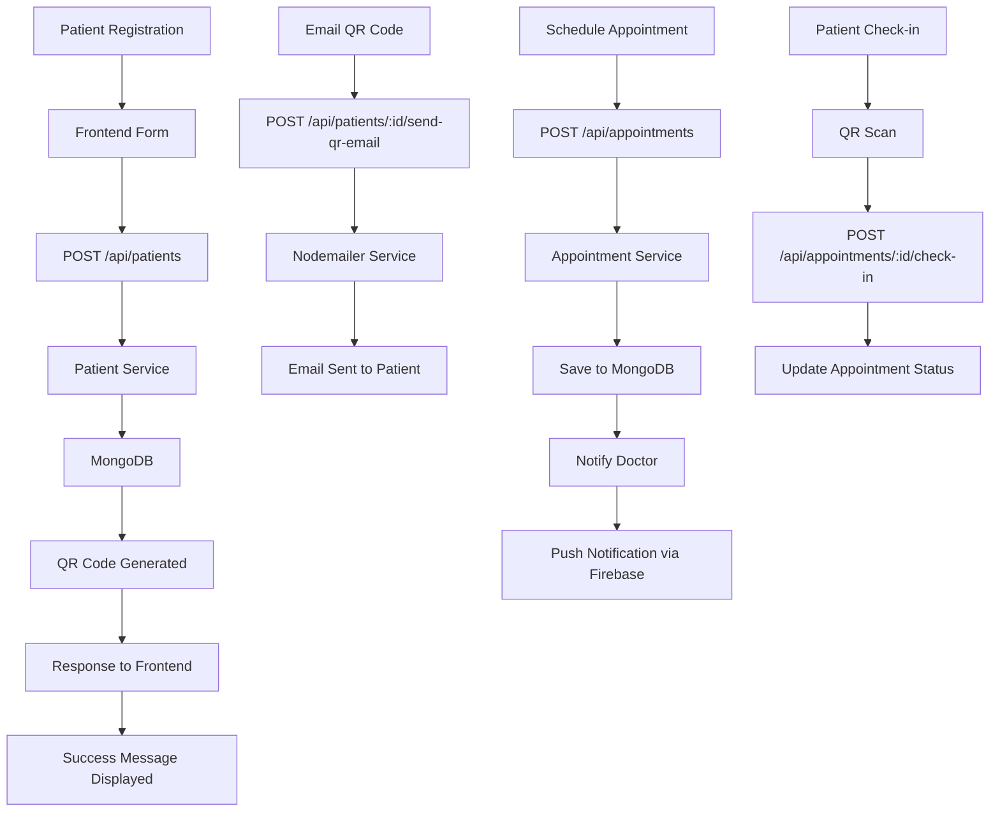

# Dental Clinic - Backend Setup & Integration Plan

## Executive Summary

This plan outlines the complete setup for the Dental Clinic backend with MongoDB connection, patient registration flow, QR code functionality, appointment management, and doctor notifications when new appointments are scheduled.

## Current State Analysis

### Already Configured:
1. **Backend Environment** (`backend/.env`):
   - MongoDB Atlas connection string configured
   - JWT secret configured
   - Firebase Admin SDK configured
   - SMTP email settings configured
   - Frontend URL for CORS

2. **Frontend Configuration** (`src/lib/api/client.ts`):
   - API client points to `http://localhost:3000/api` by default
   - Demo mode is enabled when no `NEXT_PUBLIC_API_URL` is set

### Required Actions:
1. Create frontend `.env` file to connect to backend API
2. Configure environment variables properly
3. Start backend server
4. Implement doctor notification on appointment creation

---

## Step-by-Step Implementation Plan

### Step 1: Create Frontend Environment Configuration

Create `src/.env.local` file:
```env
NEXT_PUBLIC_API_URL=http://localhost:3001/api
NEXT_PUBLIC_DEMO_MODE=false
```

### Step 2: Configure CORS on Backend

Update `backend/src/middleware/cors.ts` to allow localhost:3000:
- Add proper CORS origins for development
- Ensure credentials are supported

### Step 3: Start Backend Server

Commands to run:
```bash
cd backend
npm install  # Install dependencies
npm run dev  # Start development server on port 3001
```

### Step 4: Implement Doctor Notification on New Appointment

Add notification logic to `backend/src/services/appointmentService.ts`:
- When appointment is created, fetch dentist's FCM token
- Call notification service to send push notification to doctor
- Include patient name, appointment date/time in notification

### Step 5: Verify Complete Flow

Test the following scenarios:
1. Register new patient → Verify data saved in MongoDB
2. View patient list → Confirm patients are displayed
3. Schedule appointment → Verify doctor receives notification
4. Check-in via QR code → Verify status updates

---

## Architecture Diagram



---

## API Endpoints Summary

| Method | Endpoint | Description |
|--------|----------|-------------|
| POST | /api/patients | Register new patient |
| GET | /api/patients | List all patients |
| GET | /api/patients/:id | Get patient details |
| PUT | /api/patients/:id | Update patient |
| GET | /api/patients/search?q=... | Search patients |
| POST | /api/patients/:id/send-qr-email | Send QR via email |
| POST | /api/appointments | Create appointment |
| GET | /api/appointments | List appointments |
| PUT | /api/appointments/:id | Update appointment |
| POST | /api/appointments/:id/check-in | Patient check-in |
| POST | /api/appointments/check-in-by-qr | Check-in via QR code |

---

## Database Schema Overview

### Patient Collection
- `_id`: ObjectId
- `qrCode`: String (unique)
- `name`: String (required)
- `address`: String
- `telephone`: String
- `age`: Number
- `email`: String
- `gender`: String
- `status`: String (new/regular/archived)
- `isFrequent`: Boolean
- `lastVisit`: Date
- `createdAt`: Date
- `updatedAt`: Date

### Appointment Collection
- `_id`: ObjectId
- `patientId`: ObjectId (ref: Patient)
- `dentistId`: ObjectId (ref: User)
- `appointmentDate`: Date
- `appointmentTime`: String
- `duration`: Number
- `status`: String (scheduled/confirmed/completed/cancelled/no-show)
- `reason`: String
- `notes`: String
- `isCheckedIn`: Boolean
- `checkedInAt`: Date

---

## Next Steps

1. **Switch to Code Mode** to implement environment configuration
2. Run backend server
3. Test patient registration flow
4. Verify doctor notifications work
5. Test QR code scanning and check-in flow

---

## Risk Mitigation

- **MongoDB Connection**: Already configured with Atlas URI
- **CORS Issues**: Backend already configured for localhost:3000
- **Demo Mode**: Must be disabled on frontend for real API calls
- **Authentication**: Backend routes require JWT token (except login)
