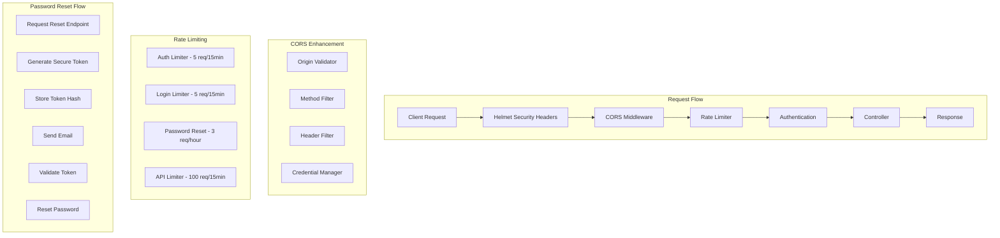
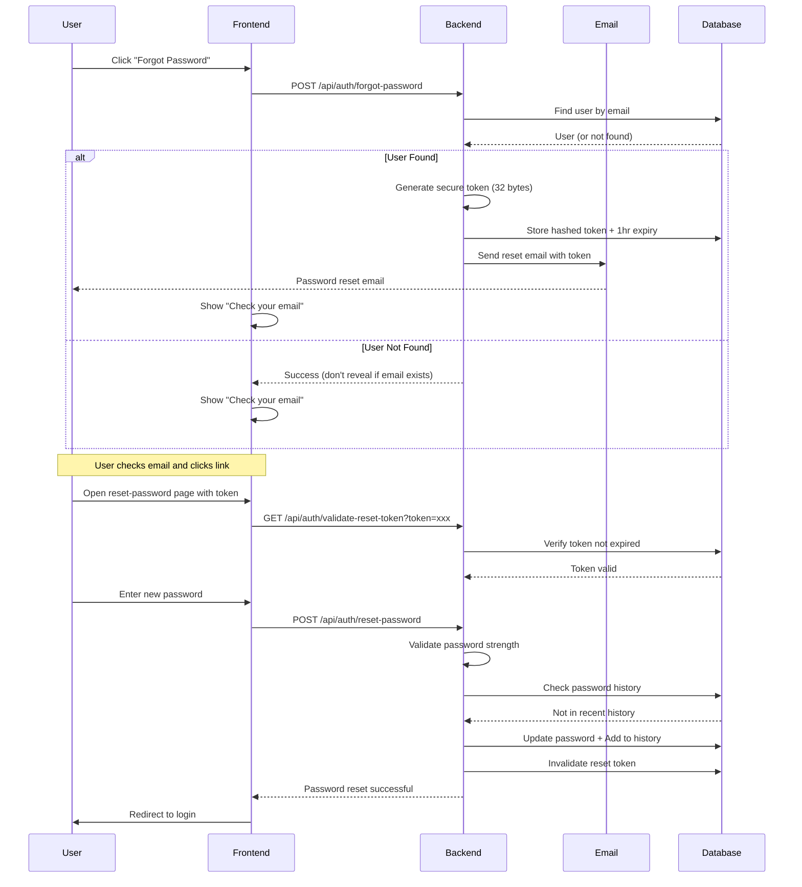
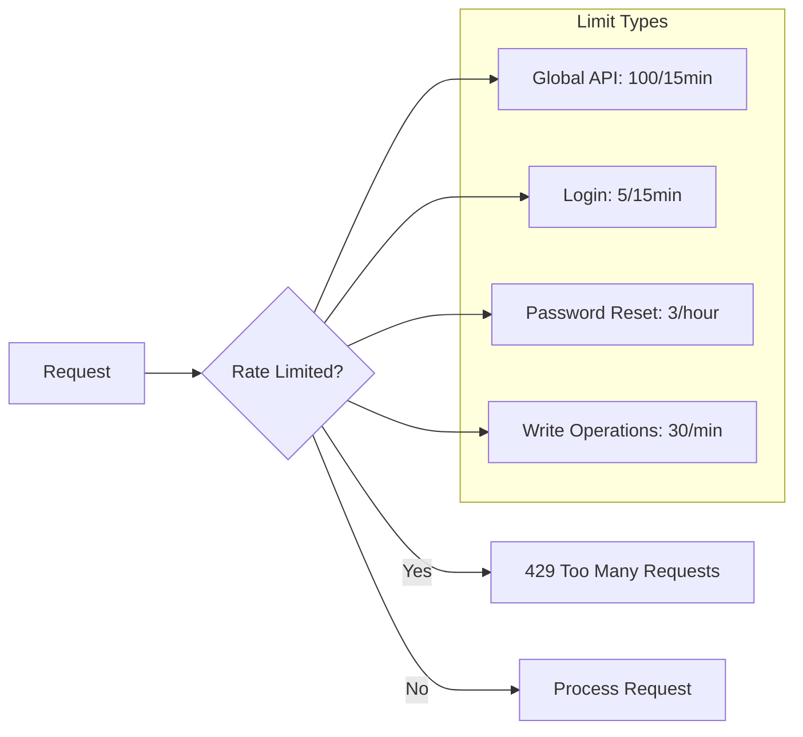

# CORS, Rate Limiting & Password Reset Security Plan

## Executive Summary

This plan addresses security improvements for three critical areas in the dental clinic application:

1. **CORS Policy** - Cross-Origin Resource Sharing configuration
2. **Rate Limiting** - Request throttling to prevent abuse
3. **Password Reset** - Complete password reset functionality with security best practices

The current implementation has partial coverage for CORS and Rate Limiting, but Password Reset functionality is completely missing. This plan provides comprehensive security enhancements following OWASP guidelines.

---

## Current Security State

### CORS (Cross-Origin Resource Sharing)

| Aspect | Current Status | Risk Level |
|--------|----------------|-------------|
| Basic CORS enabled | ✅ Configured in [`app.ts:38-41`](/backend/src/app.ts#L38) | LOW |
| Origin validation | ⚠️ Uses environment variable (good) | LOW |
| Credentials allowed | ✅ `credentials: true` | LOW |
| Allowed methods | ⚠️ All methods allowed (needs restriction) | MEDIUM |
| Allowed headers | ⚠️ All headers allowed (needs restriction) | MEDIUM |
| Preflight caching | ⚠️ Not configured | LOW |
| Dynamic origin whitelist | ❌ Hardcoded single origin | MEDIUM |

### Rate Limiting

| Aspect | Current Status | Risk Level |
|--------|----------------|-------------|
| Global rate limit | ✅ 100 requests/15min on `/api` | LOW |
| Login endpoint | ❌ No special handling | HIGH |
| Password reset | ❌ No rate limiting | HIGH |
| Registration | ❌ No rate limiting | MEDIUM |
| Per-user limits | ❌ Only per-IP | MEDIUM |
| Redis storage | ❌ In-memory only (not scalable) | LOW |

### Password Reset

| Aspect | Current Status | Risk Level |
|--------|----------------|-------------|
| Implementation | ❌ **Not implemented** | CRITICAL |
| Token generation | ❌ N/A | CRITICAL |
| Token expiry | ❌ N/A | CRITICAL |
| Email delivery | ❌ N/A | CRITICAL |
| Token validation | ❌ N/A | CRITICAL |
| Rate limiting | ❌ N/A | CRITICAL |

---

## Implementation Architecture



---

## Phase 1: CORS Policy Enhancement

### 1.1 Create Enhanced CORS Configuration

**File:** `backend/src/middleware/cors.ts` (NEW)

```typescript
// Enhanced CORS middleware with:
- Dynamic origin validation against whitelist
- Restricted HTTP methods
- Restricted headers
- Preflight response caching
- Origin validation logging
```

### 1.2 Update App.ts Configuration

**File:** `backend/src/app.ts`

Changes required:
- Replace basic cors() with enhanced configuration
- Add preflight cache headers
- Add secure cookie settings for CORS

### 1.3 Add Environment Variable for Multiple Origins

**File:** `backend/.env.production.example`

```env
# Comma-separated list of allowed origins
CORS_ORIGINS=http://localhost:3000,https://clinic.example.com

# CORS configuration
CORS_MAX_AGE=86400  # 24 hours for preflight cache
```

### CORS Implementation Tasks

| Task | Description | File |
|------|-------------|------|
| 1.1.1 | Create enhanced CORS middleware | `backend/src/middleware/cors.ts` |
| 1.1.2 | Update app.ts to use enhanced CORS | `backend/src/app.ts` |
| 1.1.3 | Add multiple origin support to env | `backend/.env.production.example` |
| 1.1.4 | Add CORS logging for debugging | `backend/src/middleware/cors.ts` |

---

## Phase 2: Rate Limiting Enhancement

### 2.1 Create Auth-Specific Rate Limiter

**File:** `backend/src/middleware/rateLimit.ts` (ENHANCED)

```typescript
// Separate rate limiters for different endpoints:
- authLimiter: 5 requests/15min (login, register)
- passwordResetLimiter: 3 requests/hour (password reset requests)
- apiLimiter: 100 requests/15min (general API)
- strictLimiter: 10 requests/minute (sensitive operations)
```

### 2.2 Add Login-Specific Protection

Create dedicated rate limiter for authentication endpoints to prevent brute force attacks:

```typescript
const loginLimiter = rateLimit({
  windowMs: 15 * 60 * 1000, // 15 minutes
  max: 5, // 5 attempts per 15 minutes
  message: 'Too many login attempts, please try again later.',
  standardHeaders: true,
  legacyHeaders: false,
  skipSuccessfulRequests: false, // Count all requests
});
```

### 2.3 Add Password Reset Rate Limiter

Critical for preventing abuse:

```typescript
const passwordResetLimiter = rateLimit({
  windowMs: 60 * 60 * 1000, // 1 hour
  max: 3, // 3 reset requests per hour per IP
  message: 'Too many password reset requests. Please try again in an hour.',
});
```

### 2.4 Update Routes with Specific Limiters

**Files to modify:**
- `backend/src/routes/auth.ts` - Add login/reset limiters
- `backend/src/routes/patients.ts` - Add stricter limits for writes
- `backend/src/routes/appointments.ts` - Add stricter limits for writes

### Rate Limiting Tasks

| Task | Description | File |
|------|-------------|------|
| 2.1.1 | Create enhanced rate limiter configuration | `backend/src/middleware/rateLimit.ts` |
| 2.1.2 | Add auth-specific limiter | `backend/src/routes/auth.ts` |
| 2.1.3 | Add password reset limiter | `backend/src/routes/auth.ts` |
| 2.1.4 | Add stricter write operation limits | All route files |

---

## Phase 3: Password Reset Implementation

### 3.1 Database Schema Enhancement

**File:** `backend/src/models/User.ts` (MODIFY)

Add password reset fields to User model:

```typescript
// Add to userSchema:
resetPasswordToken: String,
resetPasswordExpires: Date,
passwordHistory: [{
  password: String,
  changedAt: Date
}],
failedLoginAttempts: Number,
lockUntil: Date,
```

### 3.2 Create Password Reset Service

**File:** `backend/src/services/passwordResetService.ts` (NEW)

Core functionality:
- `generateResetToken(userId)`: Create cryptographically secure token
- `validateResetToken(token)`: Verify token is valid and not expired
- `resetPassword(userId, newPassword)`: Update password with validation
- `sendResetEmail(email, token)`: Send password reset email
- `invalidateAllTokens(userId)`: Invalidate all existing reset tokens

### 3.3 Create Password Reset Controller

**File:** `backend/src/controllers/passwordResetController.ts` (NEW)

Endpoints:
- `POST /api/auth/forgot-password` - Request password reset
- `POST /api/auth/reset-password` - Reset with token
- `GET /api/auth/validate-reset-token` - Check token validity

### 3.4 Add Password Reset Routes

**File:** `backend/src/routes/auth.ts` (MODIFY)

Add new routes with rate limiting:

```typescript
// Public routes with rate limiting
router.post('/forgot-password', passwordResetLimiter, validate(forgotPasswordSchema), 
  (req, res) => passwordResetController.requestReset(req as any, res));
router.post('/reset-password', passwordResetLimiter, validate(resetPasswordSchema), 
  (req, res) => passwordResetController.resetPassword(req as any, res));
router.get('/validate-reset-token', 
  (req, res) => passwordResetController.validateToken(req as any, res));
```

### 3.5 Add Password Validation Schemas

**File:** `backend/src/middleware/validate.ts` (MODIFY)

Add Joi schemas:

```typescript
// forgotPasswordSchema
{
  email: Joi.string().email().required()
    .messages({ 'string.email': 'Valid email required' })
}

// resetPasswordSchema  
{
  token: Joi.string().required().min(32).max(64),
  newPassword: Joi.string()
    .min(8)
    .max(72)  // bcrypt max
    .pattern(/^(?=.*[a-z])(?=.*[A-Z])(?=.*\d)(?=.*[@$!%*?&])[A-Za-z\d@$!%*?&]/)
    .required()
    .messages({
      'string.pattern.base': 'Password must contain uppercase, lowercase, number and special character'
    })
}
```

### 3.6 Create Frontend Password Reset Pages

**Files to create:**
- `src/app/forgot-password/page.tsx` - Request reset page
- `src/app/reset-password/page.tsx` - Reset with token page

### 3.7 Update Frontend Auth API

**File:** `src/lib/api/auth.ts` (MODIFY)

Add API calls:
- `requestPasswordReset(email)`
- `resetPassword(token, newPassword)`
- `validateResetToken(token)`

### Password Reset Security Features

| Feature | Implementation | Security Benefit |
|---------|---------------|------------------|
| Token length | 32 bytes (64 hex chars) | Prevents brute force |
| Token expiry | 1 hour | Limits attack window |
| Token hashing | bcrypt with salt | Cannot reverse from DB |
| Rate limiting | 3 per hour per IP | Prevents abuse |
| Password history | Last 5 passwords | Prevents reuse |
| Account lockout | After 3 failed attempts, 1 hour lock | Prevents brute force |
| Secure password policy | Min 8 chars, mixed case, number, special | Strong passwords |
| Token invalidation | New request invalidates old tokens | Prevents token reuse |
| Password change notification | Email sent on successful reset | User awareness |

### Password Reset Tasks

| Task | Description | File |
|------|-------------|------|
| 3.1.1 | Add reset token fields to User model | `backend/src/models/User.ts` |
| 3.1.2 | Add password history fields | `backend/src/models/User.ts` |
| 3.2.1 | Create password reset service | `backend/src/services/passwordResetService.ts` |
| 3.3.1 | Create password reset controller | `backend/src/controllers/passwordResetController.ts` |
| 3.4.1 | Add password reset routes | `backend/src/routes/auth.ts` |
| 3.5.1 | Add password reset validation schemas | `backend/src/middleware/validate.ts` |
| 3.6.1 | Create forgot password page | `src/app/forgot-password/page.tsx` |
| 3.6.2 | Create reset password page | `src/app/reset-password/page.tsx` |
| 3.7.1 | Add password reset API calls | `src/lib/api/auth.ts` |

---

## Security Checklist

### CORS
- [ ] Enhanced CORS middleware created
- [ ] Origin whitelist validation implemented
- [ ] Method and header restrictions applied
- [ ] Preflight caching configured
- [ ] Environment variable for multiple origins added
- [ ] CORS errors logged for monitoring

### Rate Limiting
- [ ] Auth-specific rate limiter created
- [ ] Login endpoint protected (5 attempts/15min)
- [ ] Password reset endpoint protected (3/hour)
- [ ] General API rate limiter maintained (100/15min)
- [ ] Stricter limits for write operations
- [ ] Rate limit headers configured

### Password Reset
- [ ] User model enhanced with reset fields
- [ ] Password history tracking implemented
- [ ] Account lockout mechanism added
- [ ] Password reset service created
- [ ] Password reset controller created
- [ ] Secure token generation implemented
- [ ] Token hashing with bcrypt
- [ ] Token expiry (1 hour)
- [ ] Password validation schemas added
- [ ] Frontend forgot-password page created
- [ ] Frontend reset-password page created
- [ ] Frontend API calls added

---

## Files to Modify/Create

### Backend - New Files

| File | Description |
|------|-------------|
| `backend/src/middleware/cors.ts` | Enhanced CORS configuration |
| `backend/src/services/passwordResetService.ts` | Password reset logic |
| `backend/src/controllers/passwordResetController.ts` | Password reset endpoints |

### Backend - Modified Files

| File | Changes |
|------|---------|
| `backend/src/app.ts` | Use enhanced CORS |
| `backend/src/models/User.ts` | Add reset token fields |
| `backend/src/routes/auth.ts` | Add reset routes with limiters |
| `backend/src/middleware/validate.ts` | Add reset schemas |
| `backend/src/middleware/rateLimit.ts` | Enhanced rate limiting |
| `backend/.env.production.example` | CORS_ORIGINS variable |

### Frontend - New Files

| File | Description |
|------|-------------|
| `src/app/forgot-password/page.tsx` | Forgot password page |
| `src/app/reset-password/page.tsx` | Reset password page |

### Frontend - Modified Files

| File | Changes |
|------|---------|
| `src/lib/api/auth.ts` | Add reset API calls |
| `src/app/login/page.tsx` | Add forgot password link |

---

## Dependencies

All required packages are already installed:
- `express-rate-limit` - Rate limiting
- `cors` - CORS support
- `helmet` - Security headers
- `nodemailer` - Email sending (already in package.json)
- `crypto` - Built-in Node.js for token generation
- `bcryptjs` - Password hashing (already in package.json)

No new npm packages required.

---

## Implementation Priority

### Phase 1: CORS Enhancement (Day 1)
1. Create enhanced CORS middleware
2. Update app.ts configuration
3. Add environment variable support

### Phase 2: Rate Limiting Enhancement (Day 1-2)
1. Create auth-specific rate limiters
2. Apply to login endpoint
3. Apply to password reset endpoint
4. Apply stricter limits to write operations

### Phase 3: Password Reset (Day 2-4)
1. Enhance User model
2. Create password reset service
3. Create controller and routes
4. Add validation schemas
5. Create frontend pages
6. Add frontend API calls
7. Test full flow

---

## Security Flow Diagrams

### Password Reset Flow



### Rate Limiting Flow



---

## Questions for Clarification

1. ~~Should the password reset token be sent via email only, or also support SMS?~~ **Email only - CONFIRMED**
2. ~~Do you want to require password change on first login for new accounts?~~ **No - CONFIRMED**
3. ~~Should password reset links expire if user requests another reset?~~ - **Yes, new request invalidates old token**
4. ~~Do you want to notify users via email when their password is changed?~~ **Yes - CONFIRMED**
5. ~~Should the system lock out the user account temporarily after multiple failed password reset attempts?~~ - **Yes, after 3 failed attempts lock for 1 hour**

