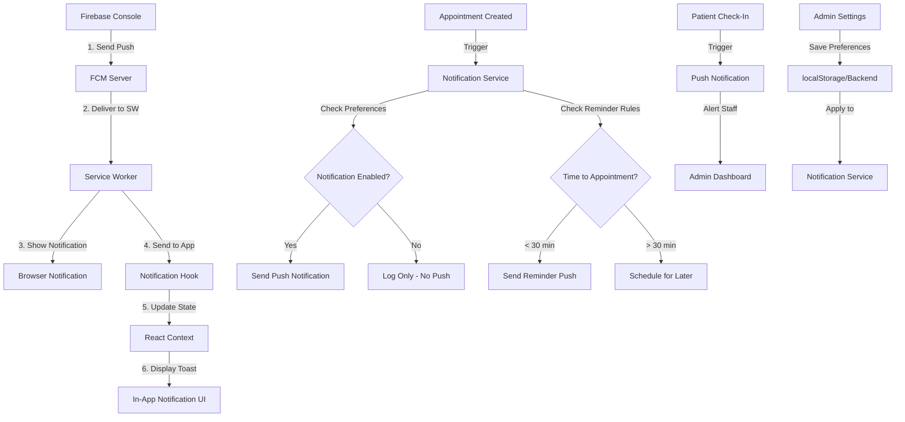

# Firebase Realtime Push Notification Integration Plan

## Overview
Integrate Firebase Cloud Messaging (FCM) into the dental clinic admin application to enable real-time push notifications for appointment reminders and alerts.

## Notification Requirements
- **Target**: Admin dashboard (dental staff)
- **Triggers**:
  - New appointment created
  - Appointment check-in (patient arrived)
  - Appointment reminders (near appointment time)
  - Appointment status changes (cancelled, completed, no-show)

## Architecture Overview

### File Structure
```
src/
├── lib/
│   └── firebase/
│       └── config.ts          # Firebase initialization & configuration
├── services/
│   └── notification.ts        # Notification service (send, subscribe, trigger)
├── hooks/
│   └── useNotifications.ts    # React hook for notification handling
├── components/
│   └── ui/
│       └── notification-toast.tsx  # In-app notification display
├── app/
│   ├── dashboard/
│   │   └── layout.tsx         # Integrate notification provider
│   └── api/
│       └── notifications/
│           └── route.ts       # API route for triggering notifications
└── public/
    └── firebase-messaging-sw.js  # Service worker for background messages
```

### Mermaid Diagram - Notification Flow



## Implementation Steps

### Phase 1: Firebase Setup
1. Install Firebase SDK packages
2. Create Firebase configuration file
3. Configure VAPID key for web push
4. Create service worker for background messages

### Phase 2: Notification Service
1. Implement notification permission request
2. Create subscription/unsubscribe methods
3. Build real-time listener for appointment events
4. Create API route for triggering notifications

### Phase 3: Frontend Integration
1. Create React hook for notifications
2. Add notification context provider
3. Implement in-app toast component
4. Integrate into dashboard layout

### Phase 4: Trigger Events
1. New appointment notification
2. Check-in alert notification
3. Scheduled reminder logic
4. Status change notifications

### Phase 5: Notification Settings UI
1. Create settings page at /dashboard/settings/notifications
2. Add notification preferences:
   - Enable/disable notification types (new appointment, check-in, reminders, status changes)
   - Sound toggle for notifications
   - Browser notification vs in-app only toggle
   - Reminder timing preferences (15 min, 30 min, 1 hour before)
3. Save preferences to localStorage (for demo) or backend
4. Persist user preferences in notification hook

### Phase 6: Notification History
1. Create notification log/history page
2. Display past 50 notifications with timestamps
3. Mark notifications as read/unread
4. Filter by notification type

## Environment Variables Required
```env
NEXT_PUBLIC_FIREBASE_API_KEY=
NEXT_PUBLIC_FIREBASE_AUTH_DOMAIN=
NEXT_PUBLIC_FIREBASE_PROJECT_ID=
NEXT_PUBLIC_FIREBASE_STORAGE_BUCKET=
NEXT_PUBLIC_FIREBASE_MESSAGING_SENDER_ID=
NEXT_PUBLIC_FIREBASE_APP_ID=
NEXT_PUBLIC_FIREBASE_VAPID_KEY=
```

## Firebase Console Setup Steps
1. Create Firebase project at console.firebase.google.com
2. Enable Cloud Messaging API
3. Generate Web Push Certificates (VAPID key pair)
4. Add the app to Firebase (web app)
5. Copy configuration credentials

## Notification Types
| Event | Title | Body | Icon | Settings Toggle |
|-------|-------|------|------|-----------------|
| New Appointment | New Appointment | {PatientName} - {Time} | Calendar | newAppointments |
| Check-in | Patient Arrived | {PatientName} has checked in | User | checkInAlerts |
| Reminder | Upcoming Appointment | {PatientName} in {Minutes} minutes | Clock | reminders |
| Status Change | Appointment Updated | {PatientName} - {NewStatus} | Alert | statusChanges |

## Next Steps
1. Confirm this plan is acceptable
2. Proceed to Code mode for implementation
3. First install Firebase SDK packages