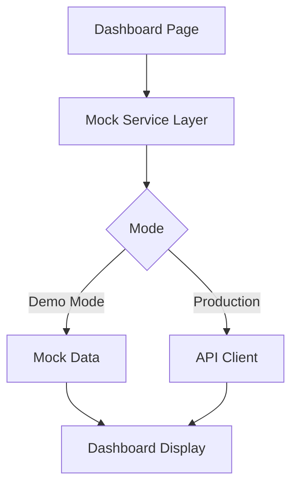

# Mock Data Plan for Demo

## Overview
Create static mock data for the frontend dashboard demo, showing realistic dental clinic data including patients, appointments, and statistics.

## Data to Create

### 1. Mock Patients (5-8 patients)
- Various ages, genders, and statuses
- Mix of new and returning patients
- Realistic dental-related complaints

### 2. Mock Appointments (8-12 appointments for today)
- Different time slots throughout the day
- Various statuses: SCHEDULED, CONFIRMED, COMPLETED
- Different appointment reasons (checkup, cleaning, toothache, etc.)

### 3. Dashboard Statistics
- Total patients count
- Today's appointments
- Pending appointments
- Completed appointments

## Implementation

### Files to Create/Modify:
1. Create `src/lib/mock/data.ts` - Central mock data file
2. Create `src/lib/mock/patients.ts` - Mock patient service
3. Create `src/lib/mock/appointments.ts` - Mock appointment service
4. Update `src/app/dashboard/page.tsx` - Use mock data

### Architecture:
```
src/lib/mock/
├── data.ts          # Static mock data objects
├── patients.ts     # Mock patient service (mirrors API)
└── appointments.ts # Mock appointment service (mirrors API)
```

## Mermaid Diagram - Data Flow



The mock services will have the same method signatures as the real API services, making it easy to switch between mock and real data by changing a configuration flag.
