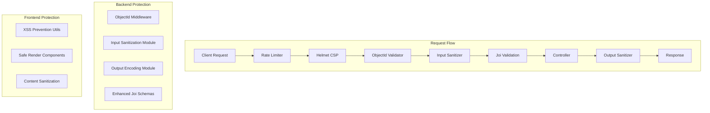

# Validation and Sanitization Security Plan

## Executive Summary

This plan addresses critical security vulnerabilities in the dental clinic web application related to **SQL/MongoDB Injection** and **Cross-Site Scripting (XSS)**. The current implementation has basic security measures but lacks comprehensive input validation and output encoding.

---

## Current Security State

### Existing Security Measures (Backend)
- ✅ Joi validation for create operations
- ✅ Express-rate-limit for brute force protection
- ✅ Helmet.js for HTTP security headers
- ✅ CORS configuration
- ✅ JWT authentication
- ✅ Role-based authorization

### Identified Vulnerabilities

| # | Vulnerability | Location | Risk Level |
|---|---------------|-----------|------------|
| 1 | No MongoDB ObjectId validation | Route params (`:id`) | **HIGH** |
| 2 | Regex injection in search queries | [`patientService.ts:88-93`](/backend/src/services/patientService.ts#L88) | **HIGH** |
| 3 | No output encoding for API responses | All controllers | **MEDIUM** |
| 4 | Weak Joi schemas (no length limits) | [`validate.ts:36-50`](/backend/src/middleware/validate.ts#L36) | **MEDIUM** |
| 5 | No CSP for XSS protection | [`app.ts`](/backend/src/app.ts) | **MEDIUM** |
| 6 | No frontend sanitization | React components | **MEDIUM** |

---

## Implementation Architecture



---

## Detailed Implementation Tasks

### Phase 1: Backend - Input Validation & Sanitization

#### 1.1 Create ObjectId Validation Middleware
**File:** `backend/src/middleware/validateObjectId.ts`

```typescript
// New middleware to validate MongoDB ObjectIds in route parameters
- Validates all :id params are valid MongoDB ObjectIds
- Prevents NoSQL injection via invalid ObjectId manipulation
- Returns 400 for invalid ObjectId format
```

#### 1.2 Create Input Sanitization Module  
**File:** `backend/src/utils/sanitizer.ts`

```typescript
// Input sanitization functions:
- sanitizeString(input: string): string
  - Trims whitespace
  - Removes null bytes
  - Escapes special regex characters
  - Limits max length
  
- sanitizeSearchQuery(input: string): string
  - Prevents regex injection
  - Escapes $ and other MongoDB operators
  - Limits to alphanumeric + basic punctuation
  
- sanitizeHtml(input: string): string  
  - Removes HTML tags if not allowed
  - Escapes HTML entities
```

#### 1.3 Enhance Joi Validation Schemas
**File:** `backend/src/middleware/validate.ts`

| Schema | Current | Enhanced |
|--------|---------|-----------|
| `name` | `string().required()` | `string().min(2).max(100).trim()` |
| `address` | `string().required()` | `string().min(5).max(500).trim()` |
| `telephone` | `string().required()` | `string().pattern(/^[0-9+\-\s()]+$/)` |
| `email` | `string().email()` | `string().email().max(255)` |
| `complaint` | `string().required()` | `string().min(3).max(2000).trim()` |
| `notes` | `string()` | `string().max(5000).trim()` |

#### 1.4 Add Output Encoding
**File:** `backend/src/middleware/sanitizeOutput.ts`

```typescript
// Middleware to sanitize all API responses
- Escape HTML entities in string responses
- Prevent XSS via API response injection
- Apply to all JSON responses
```

#### 1.5 Strengthen Helmet Configuration
**File:** `backend/src/app.ts`

```typescript
// Enhanced Helmet config:
- Content-Security-Policy (CSP) header
- X-Content-Type-Options: nosniff
- X-Frame-Options: DENY
- X-XSS-Protection: 1; mode=block
- Referrer-Policy: strict-origin-when-cross-origin
```

---

### Phase 2: Frontend - XSS Protection

#### 2.1 Create XSS Prevention Utilities
**File:** `src/lib/utils/security.ts`

```typescript
// Utility functions:
- escapeHtml(text: string): string
- sanitizeUserInput(input: string): string
- stripHtml(html: string): string
- safeInnerHTML(dangerouslySetInnerHTML): prevention
```

#### 2.2 Create Safe Render Components
**Files:** 
- `src/components/ui/safe-text.tsx`
- `src/components/ui/safe-html.tsx`

```typescript
// Components that automatically sanitize content:
- <SafeText>{userInput}</SafeText>
- <SafeHtml html={userHtml} />
```

#### 2.3 Update Existing Components
All components that display user input need wrapping:

| Component | Update |
|-----------|--------|
| `patient/payment-history.tsx` | Wrap patient names |
| `dashboard/page.tsx` | Wrap display data |
| `notifications/page.tsx` | Wrap message content |
| `appointments/*` | Wrap all user data |

---

### Phase 3: Integration

#### 3.1 Apply Middleware to Routes
Update routes to use new validation:

```typescript
// patients.ts - Add ObjectId validation
router.get('/:id', requireStaff, validateObjectId, controller.getById);
router.put('/:id', requireStaff, validateObjectId, validate(updateSchema), controller.update);

// appointments.ts - Add ObjectId validation  
router.put('/:id', requireDoctorOrAbove, validateObjectId, validate(updateSchema), controller.update);
```

#### 3.2 Apply Sanitization in Services
Update services to sanitize inputs:

```typescript
// patientService.findAll()
sanitizedSearch = sanitizeSearchQuery(search);

// appointmentService.findAll()
sanitizedPatientId = sanitizeString(patientId);
```

---

## Security Checklist

### Backend
- [ ] ObjectId validation middleware created
- [ ] Input sanitization module created
- [ ] Output encoding middleware created
- [ ] Joi schemas enhanced with length/pattern limits
- [ ] CSP headers configured in Helmet
- [ ] All routes updated with ObjectId validation
- [ ] All services updated with input sanitization

### Frontend
- [ ] XSS prevention utilities created
- [ ] Safe render components created
- [ ] All user input displays updated
- [ ] Form inputs validated client-side

### Testing
- [ ] Unit tests for sanitization functions
- [ ] Integration tests for middleware
- [ ] Manual XSS testing
- [ ] SQL injection testing

---

## Dependencies

No new npm packages required. Using:
- Built-in Node.js `Buffer` for encoding
- Joi (already installed) for enhanced validation
- Helmet (already installed) for CSP
- React's built-in escaping

---

## Files to Modify

### Backend
1. `backend/src/middleware/validate.ts` - Enhanced Joi schemas
2. `backend/src/middleware/validateObjectId.ts` - NEW
3. `backend/src/middleware/sanitizeOutput.ts` - NEW
4. `backend/src/utils/sanitizer.ts` - NEW
5. `backend/src/app.ts` - Enhanced Helmet config
6. `backend/src/routes/patients.ts` - Add validation
7. `backend/src/routes/appointments.ts` - Add validation
8. `backend/src/services/patientService.ts` - Add sanitization
9. `backend/src/services/appointmentService.ts` - Add sanitization

### Frontend
1. `src/lib/utils/security.ts` - NEW
2. `src/components/ui/safe-text.tsx` - NEW
3. `src/components/ui/safe-html.tsx` - NEW
4. Update all components displaying user input

---

## Implementation Priority

1. **Critical** - ObjectId validation (blocks injection attacks)
2. **High** - Input sanitization (prevents regex injection)
3. **High** - Output encoding (prevents XSS)
4. **Medium** - Enhanced Joi schemas
5. **Medium** - CSP headers
6. **Medium** - Frontend protection

---

## Success Criteria

- All route parameters validated as valid MongoDB ObjectIds
- All search inputs sanitized to prevent regex injection
- All API responses encoded to prevent XSS
- All user-generated content on frontend sanitized
- CSP headers block inline scripts
- No SQL/NoSQL injection vulnerabilities in automated scans